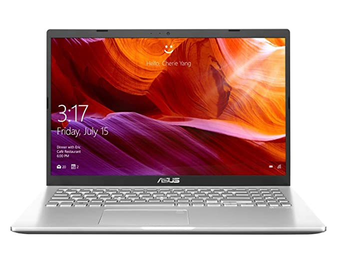

# Macbook Air Killer

[video link](https://youtu.be/xTv32WePsSI)

|    | [ASUS VivoBook 15](https://www.amazon.in/VivoBook-M509DA-EJ561T-15-6-inch-Integrated-Transparent/dp/B07WSGCC44/ref=sr_1_8?dchild=1&keywords=asus+vivobook+15+ryzen&qid=1592575508&sr=8-8) | [Apple MacBook Air](https://www.amazon.in/Apple-MacBook-Air-13-3-inch-MQD32HN/dp/B073Q5R6VR/ref=sr_1_3?dchild=1&keywords=macbook+air&qid=1592652560&sr=8-3) |
| ------------- |:-------------:|:-------------:|
|Image |   |  |
|Price | ₹33,990 | ₹65,990 |
|Display | 15.6” 1920*1080 (Full HD) 60 Hz 141.2 ppi | 13.3” 1440\*900 Retina Display 127.7 ppi |
|Storage | 256 GB SSD upgradeable | 128 GB SSD Non upgradeable |
|RAM | 4 GB DDR4 upgradeable (+8GB for ₹ 3200)|8 GB DDR3 Non Upgradable|
|Processor | AMD Quad Core Ryzen 5-3500U Processor,2.1 GHz (6MB Cache, up to 3.7 GHz) | Intel Core i5 5350U Processor, 1.8 GHz(3 MBCache, up to 2.9 GHz) |
|Graphics | Vega 8 | Intel HD 6000 |
|Ports | 2x USB 2.0, 1x USB3.1 Type A (Gen1), 1x USB3.1 Type C (Gen 1), 1 x HDMI, 1 x MicroSD | 2 x USB 3.0 , Thunderbolt 2, SDXC |
|Fingerprint Scanner | Yes | No |
|Backlit Keyboard | No | Yes |

- [Gaming Review](https://youtu.be/OI0VqLtoXEI)
- [Benefits of PPI](https://pocketnow.com/how-important-are-ppi)

## [POP OS](https://pop.system76.com)

  

Pop!\_OS is an operating system for STEM and creative professionals who use their computer as a tool to discover and create. Unleash your potential on secure, reliable open source software. Based on your exceptional curiosity, we sense you have a lot of it.

